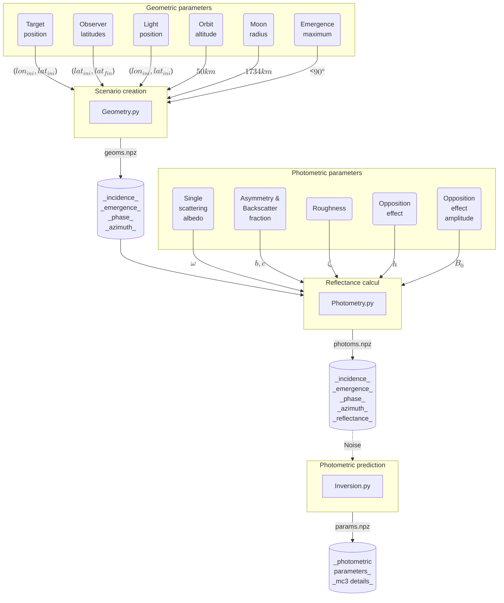

# **The "Màni" mission**
## **CNRS Geops / ESA / Paris Saclay**

Autor : _Hugo Lancery_

Contributor : _Frederic Schmidt_

> [!IMPORTANT]
> This repository is still in development phase

### **Abstract**

Our principals objectifs in the Màni mission are the prototyping and investigation of photometric scenarios in order to better characterize the geological processes of the Moon. We will study over N areas scattered across the surface and estimated their photometric behaviour using the Hapke radiative transfer model (mc3) in order to estimate their microphysical state. The mission consist in a multiple passby orbit over the targetede aeras, with an altitud of $50\ km$. A first study was condudcted in order to define optimal orbital parameters based on the reflectance behaviour.

---

### **Photometric parameters**

| Parameter                   | Symbol         | Description                                                   |
| --------------------------- | -------------- | --------------------------------------------------------------|
| Single scattering albedo    | $\omega$       | Ratio of scattering efficiency to total light extinction      |
| Dzeta                       | $\zeta$        | Hapke mean slope roughness parameter                          |
| Opposition effect amplitude | $B_0$          | Describes intensity of opposition effecte                     |
| Asymmetry parameter         | $b$            | Describes angular distribution of scattered light             |
| Backscatter fraction        | $c$            | Related to backward scattering lobe in phase function         |
| Opposition effect width     | $h$            | Width of the opposition effect                                |
| Incidence angle             | $\theta_0$     | $\angle{LCT}$ between light source and surface normal (target)|
| Emergence angle             | $\theta$       | $\angle{OCT}$ between observer and surface normal (target)    |
| Phase angle                 | $\alpha$       | $\angle{LCO}$ between light source and observer direction     |
| Azimuth angle               | $\psi$         | $\angle{L'TO'}$ between light source and observer projection  |
| Cosinus of incidence        | $\mu_o$        | Definition                                                    |
| Cosinus of emergence        | $\mu$          | Definition                                                    |
| Factor                      | $\mu_{ob}$     | Definition                                                    |
| Factor                      | $\mu_b$        | Definition                                                    |


---

### **Geometric parameters**

| Point | Description                                                      |
| ------| -----------------------------------------------------------------|
| $C$   | Center of the moon                                               |
| $L$   | Subsolar point on the moon                                       |
| $T$   | Target point on the moon surface                                 |
| $O$   | Observer point in orbit                                          |
| $L'$  | $L$ projection on the perpendicular plan of the $\vec{CT}$ vector|
| $O'$  | $O$ projection on the perpendicular plan of the $\vec{CT}$ vector|


---

### **Run the project**



> [!NOTE]
> **scenario examples**:
> 1. Target (10,0) & Light (70,0) & Observer (-180,180)
> 2. Target (10,0) & Light (-70,0) & Observer (-180,180)
> 3. Target (0,0) & Light (70,0) & Observer (-180,180)
> 4. Target (0,0) & Light (0.01,0) & Observer (-180,180)
> 5. Target (0,0) & Light (70,0) & Observer (-180,180)

### **Create scenario/orbit geometries**

The **geometry.py** script consist in the creation of the scenario. The Target and Subsolar points are considered fixed while the Observer is propagated through a constant longitude of 0°.
Each "subject" position is defined by an array of n points, which can be used to calculate key angles for the mission. The function output is a saved ".npz" file.

```python
from geometry import geometry

observer_lat_range = [-180,180]
target_position = [10,0]
light_position = [70,0]

args = (observer_lat_range, target_position, light_position)

geometry(*args, path="./data/geoms", id=1)
```
### **Apply photometry on each scenario**

The **photometry.py** script pupose is to calculate the reflectance of a surface based on a scenario geometry and it's photometric parameters.

```python
from photometry import photometry

w_list = [0.3,0.9]
bc_list = [[0.3, 0.9], [0.3, 0.5], [0.9, 0.1]]
dzeta_list = [0, 30]
h_list = [0.5]
b0_list = [1]

args = (w_list, bc_list, dzeta_list, h_list, b0_list)

photometry(*args, paths=[f"./data/geoms/geoms_id.npz"])
```

### **Predict photometric parameters from scenarios**

To study wich geometric scenario is well suited to the mission for a specific lunar geological composition. The **inversion.py** script predict the photometric parameters based on the noised reflectance received by the observer, incidence, emergence and azimuth. This allow us to judje if or not a given geometry is good for our mission specs. 

```python
from inversion import inversion
from glob import glob

for fle in glob(f"./data/photoms/ph*.npz"):
    inversion(path=fle)
```
---

### **Dependencies**

This project was conduced with the following dependencies
Conda install is the best choice to avoid any conflicts.

```
Ubuntu 24.O4 // with or without WSL
Conda 24.9.2
Python 3.9.20
```

```
mc3=3.2.0 (conda)
numba=0.60.0 (conda)
corner=2.2.2 (pip)
```